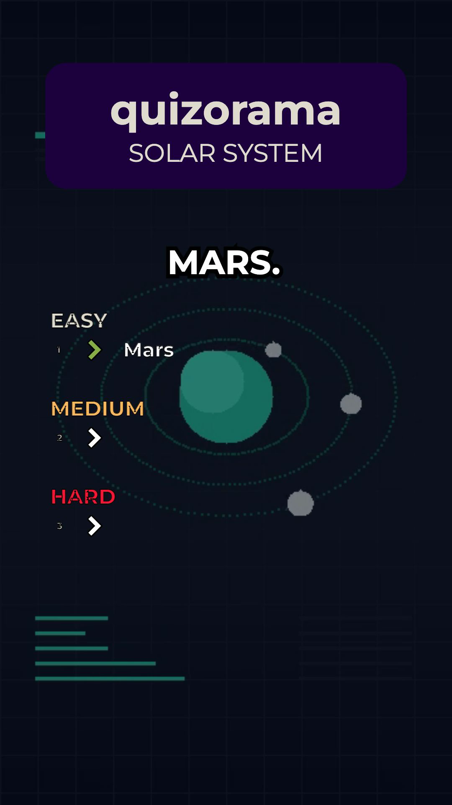
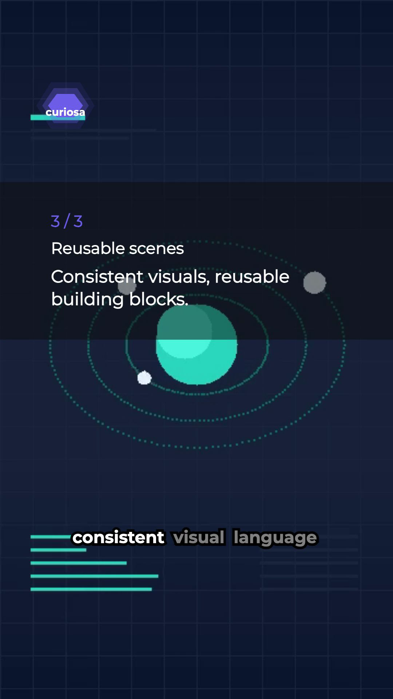
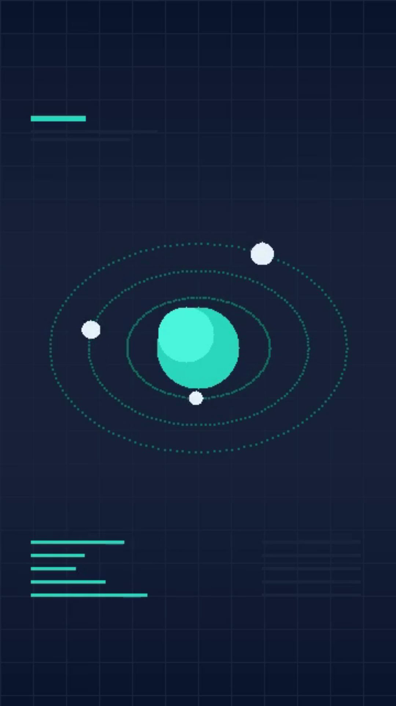

# NCStudio video renderer

Turn structured narration, word timings and media into portrait videos with React,
TypeScript and Remotion. The original renderer coordinates narrated quizzes, rankings,
animated captions and video transitions; local rendering and optional AWS Lambda
rendering share the same compositions.

| Narrated quiz | Ranking | Captioned video |
| --- | --- | --- |
|  |  |  |

[Watch quiz](https://raw.githubusercontent.com/NCorbeau/ncstudio-video/main/docs/demos/quiz.mp4) ·
[Watch ranking](https://raw.githubusercontent.com/NCorbeau/ncstudio-video/main/docs/demos/ranking.mp4) ·
[Watch captioned video](https://raw.githubusercontent.com/NCorbeau/ncstudio-video/main/docs/demos/captioned.mp4)

## Try it

Requires Node.js 22 or later. The three examples include local media and fonts.

```sh
npm ci
npm run dev
```

Remotion Studio opens with `BasicQuiz`, `Ranking` and `CaptionedVideo`. Each example
uses the original composition code with small, authored demo inputs. Render MP4s locally:

```sh
npm run render:demos
```

Or render one example with `npm run render:quiz`, `npm run render:ranking` or
`npm run render:captioned`. Results go to the ignored `out/` directory. The first render
may download Remotion's headless browser. No API keys, accounts, cloud deployment or
production media are needed for the examples.

## Explore the engineering

- [`BasicQuizTimeline`](src/BasicQuiz/BasicQuizTimeline.ts) budgets narration, thinking
  time, answer reveals, captions, progress bars and backgrounds within a portrait short.
- [`RankingTimeline`](src/Ranking/RankingTimeline.ts) coordinates narration, multi-shot
  footage, caption offsets, overlays and a closing summary.
- [`CaptionedVideo`](src/CaptionedVideo/index.tsx) combines a source video with a local
  transcription sidecar and frame-based caption display.
- Runtime schemas validate narrated inputs, caption ordering and media geometry before
  rendering. See [`src/demo`](src/demo) for editable examples.

Read the [architecture and input contracts](docs/architecture.md) for the data flow,
timing decisions, failure handling and private integration boundary.

## Checks

```sh
npm run check
```

This runs ESLint, strict TypeScript, focused timeline/schema tests and a composition
bundle. GitHub Actions also renders all three bundled examples at reduced resolution.
A passing bundle alone is not a visual render check.

## Use your own media

Supply props matching the composition's schema and media you have permission to use:

```sh
npm run render:quiz -- --props=private-inputs/quiz.json
```

Keep production props in `private-inputs/` and production media in `public/private/`;
both directories are ignored. Resolve local media through Remotion's `staticFile()`.
The captioned-video example expects a same-basename JSON sidecar. The optional
`npm run create-subtitles -- public/private/clip.mp4` command downloads Whisper.cpp
and a speech model, and can require local build tools. Its configuration is in
`whisper-config.mjs`; bundled demos do not need transcription.

## Optional cloud rendering

Generic cloud integration is public; credentials and deployment settings stay private.
Configure your own AWS credentials, region and Remotion resources before running:

```sh
npm run function:deploy
npm run deploy
REMOTION_SITE_URL=https://your-deployed-site.example/index.html npm run render:lambda
```

Remotion bundles the entire `public/` directory, including Git-ignored files. Before
cloud deployment, use a clean checkout containing only the intended deployment assets;
Git ignore rules do not prevent uploads.

These commands can create billable cloud resources. Cloud deployment was not required
or exercised for the local demos.

## Provenance

The React/TypeScript/Remotion renderer was developed for NCStudio in 2024–2025. This public
edition retains that implementation, with 2026 fixes to schemas, timing, rendering
and setup. The demo inputs, synthetic narration, geometric media and replacement
fonts were prepared in 2026; they are not the original production outputs.

Historical production inputs, deployment references, original assets and the complete
original Git history are preserved separately in a private archive. The public edition
starts from a reviewed source snapshot. The original history remains in the
[private companion](https://github.com/NCorbeau/ncstudio-video-private) for the maintainer. See [media provenance](public/demo/PROVENANCE.md)
and [publication notes](PUBLICATION.md).
